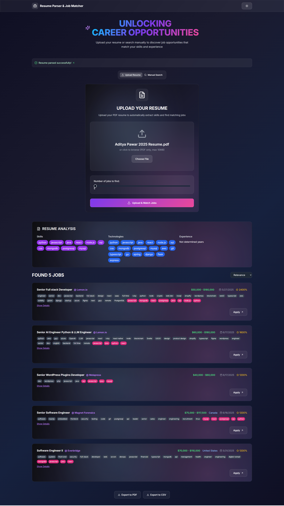

# Resume Parser & Job Matcher

A full-stack web application that allows users to upload their resume (PDF) or manually enter their skills and preferences to discover job opportunities that match their profile. The app parses resumes, extracts relevant information, and matches users to jobs using advanced filtering and scoring.

---

## Features

- **Resume Upload & Parsing:** Upload your PDF resume to extract skills, technologies, experience, and more.
- **Manual Job Search:** Enter your skills, technologies, job titles, and industries to find matching jobs.
- **Job Matching:** Intelligent matching and scoring of jobs based on your profile.
- **Job Sorting & Filtering:** Sort jobs by relevance, date posted, or salary. Filter by tags and keywords.
- **Modern UI:** Beautiful, responsive, and accessible interface with dark/light mode toggle.
- **Export Options:** Export job results to PDF or CSV.

---

## How to Clone & Run

### 1. Clone the Repository
```sh
git clone https://github.com/adityapawar327/ai-remote-jobs.git
cd ai-remote-jobs
```

### 2. Backend Setup
- Install Python 3.8+
- Install dependencies:
  ```sh
  pip install -r Backend/requirements.txt
  ```
- Start the backend server:
  ```sh
  python Backend/backend.py
  ```
  (Ensure it runs on `http://localhost:8000`)

### 3. Frontend Setup
- Install Node.js (18+ recommended)
- Install dependencies:
  ```sh
  cd Frontend
  pnpm install
  # or
  npm install
  ```
- Start the development server:
  ```sh
  pnpm dev
  # or
  npm run dev
  ```
- Visit [http://localhost:3000](http://localhost:3000)

---

## Technologies Used

### Frontend
- **Next.js** (React framework)
- **TypeScript**
- **Tailwind CSS** (utility-first CSS framework)
- **Shadcn/UI** (for UI components like Tabs, Select, Slider, etc.)
- **Lucide React** (icon library)
- **Custom CSS** (glassmorphism, gradients, modern effects)

### Backend
- **Python 3.8+**
- **FastAPI** (web framework for building APIs)
- **Uvicorn** (ASGI server for FastAPI)
- **PyPDF2** (PDF text extraction)
- **LangChain** (text splitting, vector store, and LLM integration)
- **FAISS** (vector similarity search)
- **OpenAI API** (for advanced resume parsing and embeddings)
- **LangChain OpenAI** (OpenAI integration for LangChain)
- **Requests** (HTTP requests to external APIs)
- **python-dotenv** (environment variable management)
- **Logging** (Python standard logging)
- **CORS Middleware** (for cross-origin requests)

---

## Tech Stack & Why We Use It

### Frontend
| Technology     | Why We Use It                                                      |
|:--------------|:-------------------------------------------------------------------|
| Next.js       | React framework for SSR, routing, and fast development.            |
| TypeScript    | Adds static typing to JavaScript for safer, scalable code.         |
| Tailwind CSS  | Utility-first CSS for rapid, consistent UI styling.                |
| Shadcn/UI     | Prebuilt, accessible React UI components for fast prototyping.     |
| Lucide React  | Open-source icon library for modern, customizable icons.           |
| React         | Core UI library for building interactive interfaces.               |

### Backend
| Technology      | Why We Use It                                                    |
|:---------------|:-----------------------------------------------------------------|
| Python 3.8+     | Versatile language for rapid backend and data processing.        |
| FastAPI         | High-performance, easy-to-use API framework for Python.          |
| Uvicorn         | Lightning-fast ASGI server for running FastAPI apps.             |
| PyPDF2          | Extracts text from PDF resumes for parsing.                      |
| LangChain       | LLM orchestration for text splitting, vector search, and AI.     |
| FAISS           | Efficient vector similarity search for job matching.             |
| OpenAI API      | Advanced NLP for resume parsing and embeddings.                  |
| Requests        | Simple HTTP library for API calls.                               |
| python-dotenv   | Manages environment variables securely.                          |
| Logging         | Standard Python logging for debugging and monitoring.            |
| CORS Middleware | Enables secure cross-origin requests from frontend.              |

---

## Project Structure

```
Backend/
  backend.py
  requirements.txt
Frontend/
  app/
    page.tsx
    ...
  components/
    theme-provider.tsx
    ui/
      ...
  hooks/
    ...
  lib/
    utils.ts
  public/
    ...
  styles/
    globals.css
  package.json
  tailwind.config.ts
  tsconfig.json
  ...
```

---

## Notable Packages & Libraries
- **React**
- **Next.js**
- **TypeScript**
- **Tailwind CSS**
- **Shadcn/UI**
- **Lucide React**
- **FastAPI** (or similar Python web framework)
- **PDF parsing & NLP libraries** (Python)

---

## Accessibility & UX
- Keyboard accessible
- Responsive design
- Accessible color contrast
- ARIA labels and titles for interactive elements

---

## Screenshots


---

## License

MIT License. See LICENSE file for details.

---

